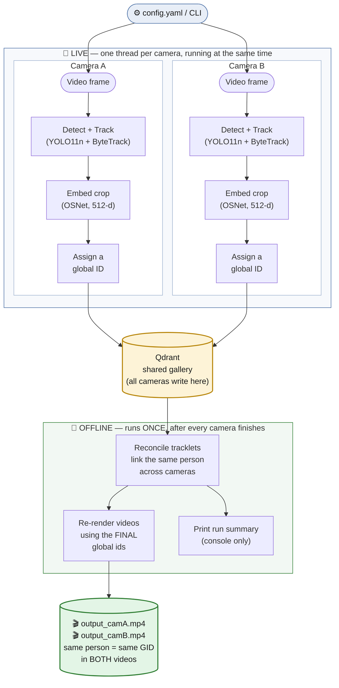

# Multi-Camera Person Re-Identification

Detect and track people across multiple camera videos, embed their appearance,
and assign a **global ID** that stays the same for one real person **across
cameras** and **across re-appearances**. Produces annotated videos.

> **How it works internally:** see **[ARCHITECTURE.md](ARCHITECTURE.md)** for the
> full data flow, every component, the concurrency model, and design rationale.
> This README is the *get-it-running* guide.

---

## How it flows



Each camera runs the **top** section live, on its own thread, checking against
one shared `registry_gallery` collection in Qdrant. Inference does **not**
write to that collection; the separate Registry service populates it. Only
after **every** camera finishes does the **bottom** section run — once: it
links the same person across cameras, then re-renders the annotated videos with
those final IDs, so one person carries the same `GID n` in every camera's
output. Full per-stage detail:
**[ARCHITECTURE.md §2](ARCHITECTURE.md)**.

---

## Table of contents
1. [Prerequisites](#1-prerequisites)
2. [Install the Python environment](#2-install-the-python-environment)
3. [Model weights](#3-model-weights)
4. [Connect to Qdrant / Registry](#4-connect-to-qdrant--registry)
5. [Configure your run](#5-configure-your-run)
6. [Run the pipeline](#6-run-the-pipeline)
7. [Understand the output](#7-understand-the-output)
8. [Troubleshooting](#8-troubleshooting)
9. [Project layout](#9-project-layout)
10. [Known limitations & roadmap](#10-known-limitations--roadmap)

---

## 1. Prerequisites

- **Python 3.10** (the project is verified on 3.10.12).
- **Docker** + **Docker Compose** — used to run the shared Qdrant server that
  Registry writes to and Inference reads from. Install Docker Desktop
  (Windows/macOS) or Docker Engine (Linux). Verify:
  ```bash
  docker --version
  docker compose version
  ```
- **One or more video files** (e.g. `.avi`, `.mp4`). RTSP URLs also work.
  CPU-only is fine — the whole pipeline runs on CPU.

---

## 2. Install the Python environment

From the project root:

```bash
python3 -m venv .venv
source .venv/bin/activate          # Windows: .venv\Scripts\activate
python -m pip install --upgrade pip
python -m pip install -r requirements.txt
```

`requirements.txt` pins the exact verified versions (ultralytics, torch,
torchvision, torchreid, qdrant-client, numpy, opencv-python, PyYAML).

> **CPU vs GPU torch:** `requirements.txt` pins CPU-compatible `torch`/
> `torchvision`. For a specific CUDA build, install torch from the official
> PyTorch wheel index for your platform *before* `-r requirements.txt`.

---

## 3. Model weights

Two model files are needed:

| File | How to get it | In a fresh clone? |
|---|---|---|
| `yolo11n.pt` (detector) | **Auto-downloaded** by ultralytics on first run | No (gitignored; fetched automatically) |
| `src/reid/weights/osnet_x1_0_market1501.pth` (ReID) | **Committed to the repo** | Yes — already present |

The OSNet checkpoint is committed, so a fresh clone already has it — no download
step. (If it is ever missing, get `osnet_x1_0_market1501.pth` from the torchreid
model zoo and place it at `src/reid/weights/`.) The path is set by `reid.weights`
in `config.yaml`.

---

## 4. Connect to Qdrant / Registry

Inference only reads from Qdrant. The Registry service populates the
`registry_gallery` collection; this repo uses it as a read-only lookup so it
can label detections and produce annotated output.

### 4a. Start the Qdrant server (recommended)

A `docker-compose.yml` is included. From the project root:

```bash
docker compose up -d          # start Qdrant in the background
docker compose logs -f        # (optional) watch logs; Ctrl-C to stop watching
```

This launches `qdrant/qdrant:latest` and exposes:
- **REST API + dashboard:** http://localhost:6333/dashboard
- **gRPC (optional):** `localhost:6334`

Data persists in `./qdrant_storage/` (gitignored), so it survives restarts.
If you already run Registry against another Qdrant endpoint, point Inference at
that same server instead.

Verify it's up:
```bash
curl http://localhost:6333/readyz        # -> "all shards are ready"
```

Stop it later with `docker compose down` (your data is kept).

### 4b. Tell the pipeline where Qdrant is

The registry lookup backend is chosen with this precedence:
**`QDRANT_URL` env var → `registry.url` in config.yaml → `store.url` /
`store.path` as a fallback for older local setups**.

Out of the box, `config.yaml` already has:
```yaml
registry:
  enabled: true
  collection: registry_gallery
  url: http://localhost:6333

store:
  enabled: false
```
so no extra step is needed for local Docker. If you prefer env-based config,
create a `.env` file in the project root:
```
QDRANT_URL=http://localhost:6333
```

For **Qdrant Cloud** instead of local Docker, set both (the API key is a secret —
`.env` is gitignored, never commit it):
```
QDRANT_URL=https://<your-cluster>.cloud.qdrant.io:6333
QDRANT_API_KEY=<your-key>
```

### 4c. Legacy only: embedded mode (no Docker)

This repo no longer uses embedded mode in the default inference flow, because
the registry gallery is meant to be shared. The old `store` path still supports
a local single-process fallback for legacy runs:
```yaml
store:
  url:                 # leave blank
  path: qdrant_data    # local folder, created automatically
```
Note: embedded mode locks the folder to one process and is dev-only.

---

## 5. Configure your run

> **You must provide your own video files.** Sample footage is **not** shipped in
> the repo (videos are gitignored). Either drop your files in and point
> `source.videos` in `config.yaml` at them, or pass them on the command line with
> `--videos` / `--videos-dir` (see section 6). The default `config.yaml` lists two
> example filenames purely as a template — edit them to your paths.

Edit [config.yaml](config.yaml). The key sections:

```yaml
source:
  videos:                        # one entry per camera
    - name: cam_219
      path: your_camera_1.avi
    - name: cam_224
      path: your_camera_2.avi
  max_frames: 0                  # 0 = whole video; N = stop early (quick test)
  resize_width: 0                # 0 = native; e.g. 1280 = faster on CPU

detector:
  model: yolo11n.pt              # auto-downloaded
  confidence_threshold: 0.4

tracker:
  enabled: true
  config: bytetrack.yaml


reid:
  enabled: true
  weights: src/reid/weights/osnet_x1_0_market1501.pth
  device: cpu                    # "cuda" if you have a GPU
  interval: 10                   # re-embed a track at most every N frames

registry:
  enabled: true
  collection: registry_gallery
  url: http://localhost:6333     # shared Qdrant server (see section 4)
  threshold: 0.85                # cosine to accept a registry match
  top_k: 5

store:
  enabled: false                 # legacy identity pipeline only

identity:
  enabled: false                 # legacy identity pipeline only
  reconcile:
    enabled: true
    same_camera_threshold: 0.90
    min_tracklet_observations: 3
    require_reciprocal_best: true

display:
  show_window: false             # true = live OpenCV windows; false = headless
  save_annotated: true           # write output_<camera>.mp4
```

See [ARCHITECTURE.md §7](ARCHITECTURE.md) for what every knob does.

---

## 6. Run the pipeline

With the venv active and the shared Qdrant server reachable:

```bash
python main.py                       # uses the videos listed in config.yaml
```

### Run on your OWN videos (dynamic input — no config edits)

Point the pipeline at any videos from the command line; this **overrides**
`config.yaml`, so you never have to hardcode paths:

```bash
# one or more explicit files (camera name = the file's base name):
python main.py --videos /path/cam_a.mp4 /path/cam_b.mp4

# every video in a folder (.mp4/.avi/.mov/.mkv/...):
python main.py --videos-dir /path/to/footage

```

Precedence: `--videos` > `--videos-dir` > `config.yaml source.videos`. Missing
files fail fast with a clear message; duplicate names are made unique
automatically.

If you need the legacy reset path, `--reset` wipes the old `store` collection
first. It does not touch `registry_gallery`.

```bash
python main.py --reset --videos-dir /path/to/footage
```

Headless (`display.show_window: false`) runs to completion and prints a summary.
With windows enabled, press `q` in a window to stop early.

---

## 7. Understand the output

A run produces:

| Artifact | Location | What it is |
|---|---|---|

| Annotated videos | `output_<camera>.mp4` | source video with boxes + `GID n  IDk` labels drawn |
| Registry gallery | Qdrant (`registry_gallery` on the shared server) | read-only lookup for names / employee ids |

That's it — no crop images and no report files are written. (Per-person crop
images can be turned back on with `crops.save: true` in `config.yaml`, e.g. to
collect ReID training data, but they are **off by default**.)

Registry lookups do not change the gallery contents during inference. The
console still prints a **RUN SUMMARY** at the end for the legacy identity path,
e.g.:
```
Store: 516 observations -> 11 distinct people (global_ids)
Cross-camera people: 1
  GID 1: cam_219 (track 0004 + 0025) + cam_224 (track 0001)
```
- **distinct people** = number of global IDs after reconciliation.
- **Cross-camera people** = global IDs seen in more than one camera (the product's
  core result).

---

## 8. Troubleshooting

| Symptom | Cause / fix |
|---|---|
| `Connection refused` / registry errors | Qdrant isn't running or `registry_gallery` is unavailable. `docker compose up -d`, then `curl http://localhost:6333/readyz`. |
| `Unexpected checkpoint keys dropped` | Wrong/corrupt ReID weights. Re-fetch `osnet_x1_0_market1501.pth` to `src/reid/weights/`. |
| Hangs on first run for a while | `yolo11n.pt` is downloading; subsequent runs are fast. |
| Very slow on CPU | Set `source.resize_width: 1280` and/or `source.max_frames` for tests. |
| "database is locked" | Legacy embedded mode (`store.path`) is single-process. Use the shared Docker server (`registry.url` or `store.url`). |
| No windows appear | `display.show_window: false` (headless). Set `true` for live windows. |
| Counts look too high / people split | Expected on out-of-domain footage — see limitations below. |

---

## 9. Project layout

```
main.py                     entry point + per-camera orchestration
config.yaml                 all runtime configuration
requirements.txt            pinned dependencies
docker-compose.yml          Qdrant server
ARCHITECTURE.md             deep-dive: data flow, components, design
src/
  video_source.py           frame decoding
  detector.py               YOLO11 + ByteTrack, Detection, crop_person
  crop_saver.py             per-track crop persistence (only when crops.save: true)
  drawing.py                boxes / HUD overlay
  reid/
    extractor.py            crop -> 512-d L2-normalized embedding (OSNet)
    service.py              TrackEmbedder: throttle, cache, quality + occlusion gates
    weights/                ReID model checkpoint
  database/
    store.py                Qdrant wrapper (PersonVectorStore; legacy writes, read-only lookups)
  identity/
    service.py              live global-ID assignment (candidate->decide->commit)
    reconcile.py            offline cross-camera reconciliation
    DESIGN.md               why the layers are separated
tools/
  prepare_randperson_subset.py   dataset prep for the model-fix path
notebooks/                  training/experiment notebooks (incl. RandPerson)
```

Generated at runtime (gitignored): `output_*.mp4`,`qdrant_storage/`, `qdrant_data/`.

---
